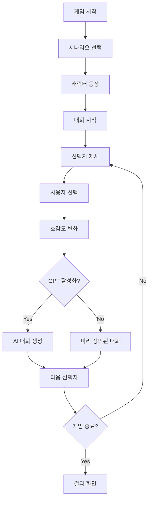

# 🎮 MBTI 기반 AI 채팅 게임 프로젝트

## 📋 프로젝트 개요

**프로젝트명**: yuna-chat-game  
**버전**: 1.0.0  
**설명**: MBTI 성격 유형을 기반으로 한 AI 로맨스 채팅 게임  
**플랫폼**: 웹 기반 (Vercel 배포)  
**개발 기간**: 2025년 8월 ~  

### 🎯 핵심 컨셉
- MBTI 성격 유형별 캐릭터와의 로맨틱 대화 시뮬레이션
- GPT API를 활용한 동적 대화 생성
- 선택지 기반 호감도 시스템
- 다중 시나리오 및 캐릭터 지원

## 🗂️ 프로젝트 구조

### 📁 핵심 파일
```
chatgame-github/
├── 🎮 게임 인터페이스
│   ├── multi-scenario-game.html     # 메인 게임 (현재 주력)
│   ├── chat-room-game.html         # 채팅룸 스타일 게임
│   ├── choice-chat.html            # 선택지 기반 채팅
│   └── index.html                  # 메인 페이지
│
├── ⚙️ 관리자 인터페이스  
│   ├── scenario-admin.html         # 시나리오/캐릭터 관리
│   ├── admin.html                  # 구 관리자 페이지
│   └── admin-new.html              # 새 관리자 페이지
│
├── 🔗 API 엔드포인트
│   └── api/
│       ├── scenario.js             # 시나리오/캐릭터/GPT 생성
│       ├── chat.js                 # 채팅 관련
│       ├── choice.js               # 선택지 처리
│       ├── profile.js              # 프로필 관리
│       └── test.js                 # API 테스트
│
├── 📊 데이터
│   └── data/
│       ├── scenarios.json          # 시나리오 정의
│       ├── characters.json         # 캐릭터 정의
│       ├── dialogues.json          # 대화 데이터
│       └── dialogue_database.json  # 대화 데이터베이스
│
├── 🎨 리소스
│   ├── photo/                      # 캐릭터 사진
│   │   ├── 윤아.jpg
│   │   └── 미나.png
│   └── assets/
│       ├── images/
│       ├── styles/
│       └── scenarios/
│
└── 📚 문서
    ├── CLAUDE.md                   # 개발 작업 노트
    └── PROJECT.md                  # 프로젝트 개요 (이 파일)
```

## 👥 캐릭터 시스템

### 🌟 현재 구현된 캐릭터

#### 1. 윤아 (INFP) - 주력 캐릭터
- **나이**: 20세
- **성격**: 감성적, 이상주의적, 창의적, 내향적
- **관계**: 시우 오빠를 1년 넘게 좋아하는 후배
- **배경**: 예술 전공 대학생, 감수성이 풍부함
- **말투**: 부드럽고 따뜻한 말투, 이모티콘 자주 사용

#### 2. 미나 (ENFP) - 부가 캐릭터
- **나이**: 22세  
- **성격**: 외향적, 감정적, 융통성 있음
- **관계**: 같은 과 선배, 친근한 관계
- **배경**: 학생회 활동하는 적극적인 선배
- **말투**: 친근하고 따뜻함, 격려하는 표현

## 🎲 시나리오 시스템

### 📖 현재 시나리오

#### 1. "어제 밤의 기억" (hangover_confession) ⭐ 메인
- **설정**: 다음날 아침, 메신저로 연락
- **상황**: 윤아가 어제 술 먹고 고백한 후 부끄러워하는 상황
- **분위기**: 부끄러움, 설렘, 긴장감
- **상태**: 활성화 (현재 주력 시나리오)

#### 2. "함께 공부하기" (study_together)
- **설정**: 조용한 도서관
- **상황**: 도서관에서 같이 공부하는 상황  
- **분위기**: 집중, 은밀한 대화
- **상태**: 비활성화 (개발 예정)

## 🔧 기술 스택

### Frontend
- **HTML5**: 게임 인터페이스 구성
- **CSS3**: 반응형 채팅 UI 디자인
- **JavaScript (ES6+)**: 게임 로직 및 상태 관리
- **Fetch API**: 서버 통신

### Backend
- **Node.js**: 서버사이드 런타임
- **Vercel Functions**: 서버리스 API
- **OpenAI API**: GPT 기반 대화 생성

### 외부 서비스
- **GitHub**: 소스 코드 관리
- **Vercel**: 배포 및 호스팅
- **OpenAI**: AI 대화 생성

## 🚀 현재 배포 상태

**배포 URL**: https://chatgame-seven.vercel.app/  
**메인 게임**: https://chatgame-seven.vercel.app/multi-scenario-game.html  
**관리자**: https://chatgame-seven.vercel.app/scenario-admin.html  

## ⚡ 핵심 기능

### 🎮 게임 플레이 기능
- ✅ **선택지 기반 대화**: 3가지 선택지로 호감도 조절
- ✅ **호감도 시스템**: 선택에 따른 호감도 변화 및 표시
- ✅ **진행도 추적**: 현재 대화 턴 및 전체 진행 상황
- ✅ **타이핑 효과**: 실제 채팅처럼 타이핑 인디케이터
- ✅ **자동 스크롤**: 메시지 자동 하단 이동
- ✅ **중복 입력 방지**: 처리 중 추가 입력 차단

### 🤖 AI 대화 생성
- ✅ **GPT 통합**: OpenAI API로 동적 대화 생성
- ✅ **MBTI 반영**: 캐릭터 성격에 맞는 응답 생성
- ✅ **상황 인식**: 현재 시나리오와 호감도 고려
- ✅ **Fallback 시스템**: GPT 실패 시 미리 정의된 대화 사용

### 🎛️ 관리자 기능
- ✅ **시나리오 관리**: 시나리오 조회/편집
- ✅ **캐릭터 관리**: 캐릭터 정보 조회/편집
- ✅ **대화 관리**: 실제 게임 대화 내용 확인/수정
- ⚠️ **이미지 업로드**: 캐릭터 사진 서버 업로드 (개선 필요)

## 🔄 게임 플로우



## 📊 현재 개발 상태

### ✅ 완료된 기능
- [x] 기본 게임 인터페이스 구현
- [x] 선택지 기반 호감도 시스템
- [x] GPT API 통합 및 동적 대화 생성
- [x] 시나리오/캐릭터 관리 시스템
- [x] 관리자 인터페이스
- [x] 자동 스크롤 및 UI/UX 개선
- [x] 중복 입력 방지 시스템
- [x] TypeError 및 API 오류 해결
- [x] Vercel 배포 및 Git 워크플로우

### 🚧 진행 중인 작업
- [ ] 캐릭터 이미지 서버 업로드 기능
- [ ] 대화 메모리 관리 시스템
- [ ] 추가 시나리오 개발
- [ ] 성능 최적화

### 📋 향후 계획
- [ ] 다중 캐릭터 동시 대화
- [ ] 사용자 프로필 시스템
- [ ] 대화 내역 저장 기능
- [ ] 모바일 최적화
- [ ] 음성 메시지 지원

## 🐛 알려진 이슈

### 해결된 문제들
- ✅ **btoa() 인코딩 오류**: UTF-8 인코딩으로 해결
- ✅ **500 API 오류**: API 간소화로 해결
- ✅ **JavaScript 문법 오류**: 구문 검증으로 해결
- ✅ **스크롤 문제**: scrollToBottom() 함수로 해결
- ✅ **중복 입력 문제**: 상태 플래그로 해결
- ✅ **TypeError 문제**: 데이터 검증 강화로 해결

### 현재 개선 필요 사항
- ⚠️ **이미지 업로드**: 캐릭터 사진 서버 업로드 기능
- ⚠️ **메모리 관리**: 장시간 플레이 시 메모리 사용량 증가
- ⚠️ **로딩 성능**: 초기 로딩 시간 최적화 필요

## 🔧 개발 환경 설정

### 로컬 개발
```bash
# 저장소 클론
git clone https://github.com/EnmanyProject/chatgame.git
cd chatgame

# 의존성 설치
npm install

# 로컬 서버 실행 (Live Server 등 사용)
# Vercel CLI로 로컬 테스트
vercel dev
```

### 배포
```bash
# 변경사항 커밋
git add .
git commit -m "업데이트 내용"
git push origin main

# Vercel 자동 배포 실행됨
```

## 📝 개발 가이드라인

### 코드 스타일
- ES6+ 문법 사용
- 한글 변수명/함수명 허용 (게임 특성상)
- 상태 관리는 gameState 객체 사용
- 모든 메시지 출력 후 scrollToBottom() 호출

### API 설계
- RESTful 방식 지향
- action 파라미터로 기능 구분
- 에러 처리 및 fallback 로직 필수

### Git 워크플로우
- main 브랜치에 직접 커밋
- 상세한 커밋 메시지 작성
- CLAUDE.md 파일로 작업 노트 관리

## 📞 연락처 및 참여

**개발자**: dosik + Claude Code  
**저장소**: https://github.com/EnmanyProject/chatgame  
**이슈 트래킹**: GitHub Issues 사용  
**문서**: CLAUDE.md (개발 작업 노트)  

---
*최종 업데이트: 2025-08-28*  
*프로젝트 상태: 활발한 개발 진행 중* 🚀